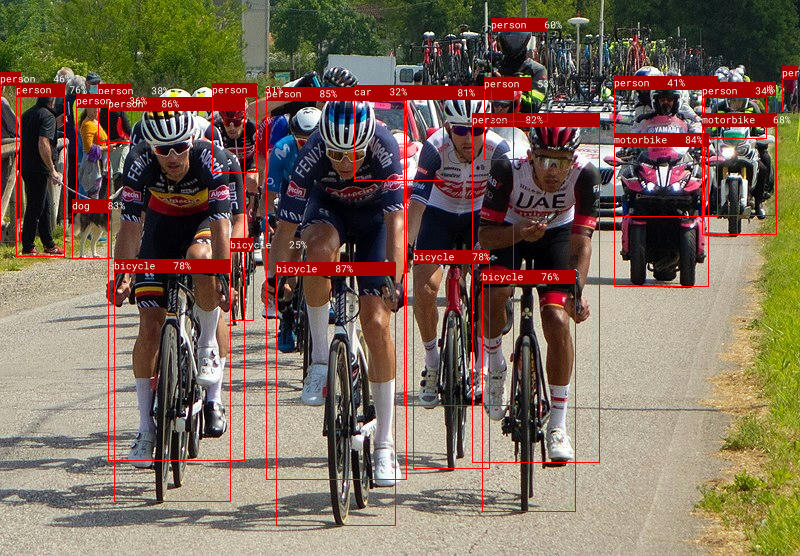
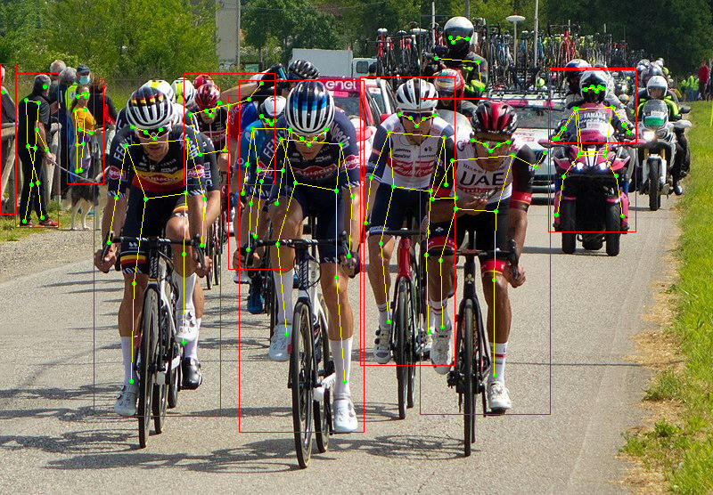

# lantern-yolo-v8: Object Detection and Pose Estimation

This is a port of [Ultralytics
YOLOv8](https://github.com/ultralytics/ultralytics). The implementation is based
on the [tinygrad
version](https://github.com/tinygrad/tinygrad/blob/master/examples/yolov8.py)
and on the model architecture described in this
[issue](https://github.com/ultralytics/ultralytics/issues/189). The supported
tasks are object detection and pose estimation.

You can try this model online on the [lantern YOLOv8
Space](https://huggingface.co/spaces/lmz/lantern-yolo). The model then fully runs
in your browser using WebAssembly - if you use a custom image it will never
leave your phone/computer!

## Running some example

### Object Detection
```bash
cargo run --example yolo-v8 --release -- lantern-examples/examples/yolo-v8/assets/bike.jpg
```

This prints details about the detected objects and generates a `bike.pp.jpg` file.


Image source:
[wikimedia](https://commons.wikimedia.org/wiki/File:Leading_group,_Giro_d%27Italia_2021,_Stage_15.jpg).



### Pose Estimation
```bash
cargo run --example yolo-v8 --release -- \
  lantern-examples/examples/yolo-v8/assets/bike.jpg --task pose
```



### Command-line flags

- `--which`: select the model variant to be used, `n`, `s` , `m`, `l`, or `x` by
  increasing size and quality.
- `--task`: `detect` for object detection and `pose` for pose estimation.
- `--legend-size`: the size of the characters to print.
- `--model`: use a local model file rather than downloading it from the hub.

